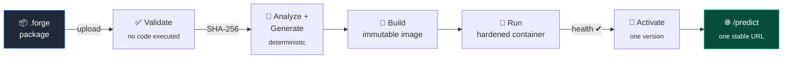
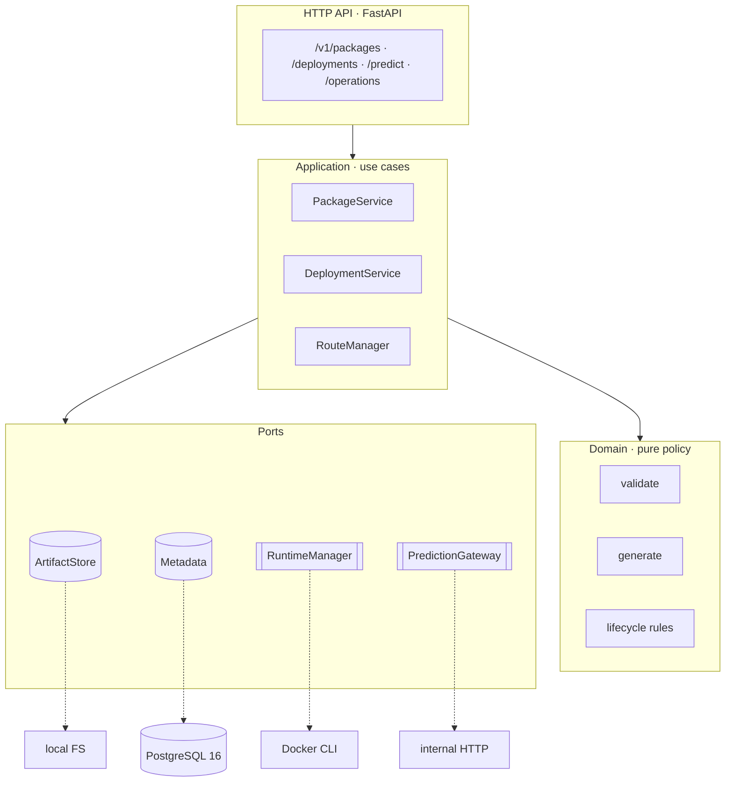

<div align="center">


<br>

Point ForgeML at a packaged model. It validates it, builds an immutable image, runs it
in a locked-down container, and gives you one stable URL with atomic version switching
and instant rollback. You write `predict()`. ForgeML does the plumbing.

[](https://github.com/Riicko-19/ForgeML/actions/workflows/backend-quality.yml)


</div>

---

## The problem

You have a serialized model and a `predict` function. Getting it behind a reliable HTTP
endpoint means hand-writing a Dockerfile, a web server, input validation, health checks,
resource limits, a build pipeline, a deployment story, and a rollback plan — the same
plumbing, re-invented per model, and usually under-hardened.

ForgeML makes that path a **contract**. A model becomes a `.forge` package; a package
becomes an immutable, content-addressed image; an image becomes an isolated runtime; a
runtime becomes one platform-managed route with a documented lifecycle. Every step is
deterministic, auditable, and reversible.

> **What ForgeML is:** a clean, self-hosted deployment path for **trusted** inference
> models on **one server**.
> **What it is not:** a training platform, an experiment tracker, or a multi-tenant
> cloud. It does one thing and refuses to sprawl (see [Non-goals](#non-goals)).

---

## The whole arc, in one picture



A client only ever sees the last box. It never learns a container id, an image, or an
internal endpoint — it sends a JSON document and gets a prediction back.

---

## Quickstart

**Requirements:** Python **3.11** (ADR-013), **Docker**, and **PostgreSQL 16**
(ADR-009 — SQLite is not supported: durable operation claims need row-locking semantics
it cannot express).

```bash
make setup      # venv + hash-locked dependencies
make db         # PostgreSQL 16 in Docker
make migrate    # apply the schema
make run        # control plane on http://127.0.0.1:8000
```

In another terminal — build the sample model and drive the pipeline:

```bash
make example    # builds examples/hello-model.forge

# 1) Upload. Returns 202 + a durable operation you can poll.
curl -X POST http://127.0.0.1:8000/v1/packages \
  -H "Idempotency-Key: $(uuidgen)" \
  -F "file=@examples/hello-model.forge"

# 2) Create a deployment (a stable name for a succession of versions)
curl -X POST http://127.0.0.1:8000/v1/deployments \
  -H "Content-Type: application/json" -d '{"name":"scorer"}'

# 3) Build + run a version, then 4) activate it as the route target
curl -X POST http://127.0.0.1:8000/v1/deployments/<id>/versions \
  -H "Idempotency-Key: $(uuidgen)" -d '{"package_id":"<package_id>"}'
curl -X POST http://127.0.0.1:8000/v1/deployments/<id>/versions/<version_id>/activate \
  -H "Idempotency-Key: $(uuidgen)"
```

The endpoint your clients then call:

```http
POST /v1/deployments/scorer/predict
{ "value": 21 }              →  200  { "score": 21.0 }
```

> Prediction forwarding reaches the model on ForgeML's **internal Docker network**, so
> the control plane must share that network with the runtimes (the production topology,
> ADR-010). Upload, build, deploy, and activation all work directly on the host.
> `make help` lists every task; the [Postman collection](docs/postman/) has the full API
> wired up with assertions.

---

## Why it holds up

|  | Guarantee | How |
| --- | --- | --- |
| 🔒 | **Validation never runs your code** | The validator parses and schema-checks the archive; an architecture test fails the build if any validation path so much as imports `pickle`. |
| 🧱 | **Immutable, content-addressed artifacts** | A package is identified by the SHA-256 of its bytes; a build's identity folds in its inputs. Duplicate uploads are idempotent; builds are reproducible (ADR-003). |
| ♻️ | **Crash-safe by construction** | Every long action (validate, build, start, activate, reconcile) is a durable, idempotent operation with a terminal state and startup recovery — no double-execution window (ADR-006/016). |
| 🎯 | **One active version, atomic switch** | Activation health-checks the candidate, then swaps the route under a row lock: the old version steps down and the new one takes over, or neither does. Rollback is activating a prior version (ADR-005). |
| 🛡️ | **Hardened runtimes** | Non-root, read-only rootfs, all Linux capabilities dropped, `no-new-privileges`, CPU/memory/PID limits, an egress-free internal network, and **no Docker socket** — asserted against a live `docker inspect` (ADR-001). |
| 🧭 | **Desired vs. observed state** | Metadata is intent; Docker is observation. Reconciliation records and heals drift through documented actions — Docker is never treated as a database (ADR-004). |
| 📋 | **Nothing hidden** | Append-only audit log, server-owned request IDs, a single error envelope, and errors that never leak host paths, traces, or raw provider output. |

---

## Architecture

A **modular monolith**: one deployable, hexagonal internals. Domain logic is pure and
deterministic; every I/O boundary is a **port** with a real adapter *and* an in-memory
fake, both held to one conformance suite so the fakes can't drift.



- **Domain never imports a provider.** `RouteManager` can't import Docker; `sqlalchemy`
  can't escape the database adapter — both enforced by AST tests in CI.
- **The runtime speaks CLI, not an SDK** — zero added runtime dependencies; the one
  seam that touches `subprocess` is injectable, so lifecycle logic is unit-tested
  without Docker and proven end-to-end by disposable-Docker integration tests.
- **Adapters are swappable:** filesystem + PostgreSQL today; the ports don't care.

Full design lives in [`ForgeML_Engineering_Kit_Phase0/docs/`](ForgeML_Engineering_Kit_Phase0/docs/)
(architecture, low-level design, external contracts, and every ADR).

---

## Security model — read this before you deploy

ForgeML runs code that packages supply, so its trust boundary is explicit and narrow:

> **There is no authentication yet.** V1 assumes a **single trusted operator on a
> protected administrative network**. A package is a trusted administrative artifact,
> **not** a file accepted from anonymous users. **Do not expose the control plane to a
> network you do not control.** Public exposure requires an authorization decision
> (an ADR) that does not exist yet.

Within that boundary, isolation is defense-in-depth, not a safe sandbox for hostile
code: runtimes are unprivileged, read-only, capability-stripped, resource-limited, and
network-isolated (ADR-001). The honesty is the point — the limits are documented, tested,
and enforced, not assumed.

---

## Status & roadmap

**Alpha — the V1 backend is being built module by module.** Contracts freeze before
anything depends on them; a module is *frozen* only with passing CI evidence on its exact
commit (ADR-014). Live truth is always [PROJECT_STATUS.md](PROJECT_STATUS.md).

| # | Module | State |
| --- | --- | --- |
| 0–2 | Foundation · Forge Package · Metadata | ✅ **Frozen** |
| 3 | Backend API | ✅ Implemented |
| 4 | Analyzer / Generator | ✅ Implemented |
| 5 | Deployment lifecycle | ✅ Implemented |
| 6 | Docker runtime | ✅ Implemented |
| 7 | Routing & version activation | ✅ Implemented |
| 8 | Monitoring (logs, metrics, retention) | ⬜ Next |
| 9 | Dashboard | ⬜ Planned |
| 10 | Hardening & release (backups, SBOM/scan, perf) | ⬜ Planned |

*Implemented* modules pass the full local checkpoint and await their freeze commit.

---

## Engineering standards

This repo treats its own process as a product.

- **One checkpoint, everywhere.** `make verify` runs the exact gates CI runs — format
  (`black`), lint (`ruff`), types (`mypy --strict`), the full test suite, contract
  tests, a locked build, and an installed-wheel smoke test — on Python 3.11 against a
  real PostgreSQL 16. Green locally means green in CI.
- **583 tests, ~97% branch coverage**, spanning unit, contract (run against real
  adapters *and* their fakes), integration (real PostgreSQL, disposable Docker),
  end-to-end, and architecture (dependency-direction) tests.
- **Decisions are written down.** 17 Architecture Decision Records capture the *why*,
  with rejected alternatives, so they aren't re-litigated.
- **[`.forgeos/`](.forgeos/)** — a repository-first engineering operating system:
  governance, roles, workflows, and templates, so any contributor (human or AI) can
  clone the repo and contribute correctly without prior context.

```bash
make test    # full suite (needs `make db`)
make lint    # black + ruff + mypy --strict (rewrites); `make verify` only checks
```

---

## Documentation

| Where | What |
| --- | --- |
| [PROJECT_STATUS.md](PROJECT_STATUS.md) | What's frozen, what's next, evidence |
| [backend/README.md](backend/README.md) | Configuration reference, API, quality gates |
| [`…/docs/`](ForgeML_Engineering_Kit_Phase0/docs/) | Architecture, ADRs, per-module designs |
| [docs/postman/](docs/postman/) | The API, hands-on, with assertions |
| [.forgeos/](.forgeos/) | Engineering governance & process |

---

## Non-goals

Kept out **on purpose**, so the core stays sharp. Each would require an ADR to enter
scope — none is a "small addition":

`Kubernetes` · `multi-host scheduling` · `autoscaling` · `multi-tenancy` · `GPU scheduling`
· `traffic splitting / canary / blue-green` · `a marketplace` · `training & experiments`
· `arbitrary public package execution`

---

## License

A license has **not** been finalized yet. Until one is added, all rights are reserved by
the author — please open an issue if you need clarity on usage. A license file will land
before the first tagged release.

<div align="center"><sub>ForgeML · single-server model deployment control plane · built in the open, one frozen contract at a time.</sub></div>
