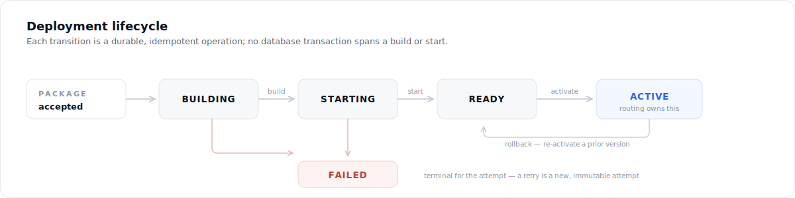
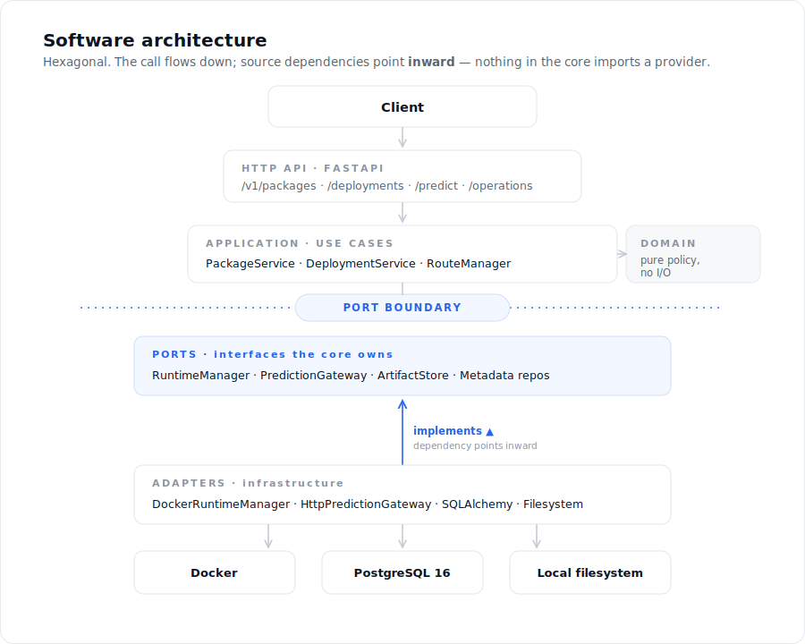
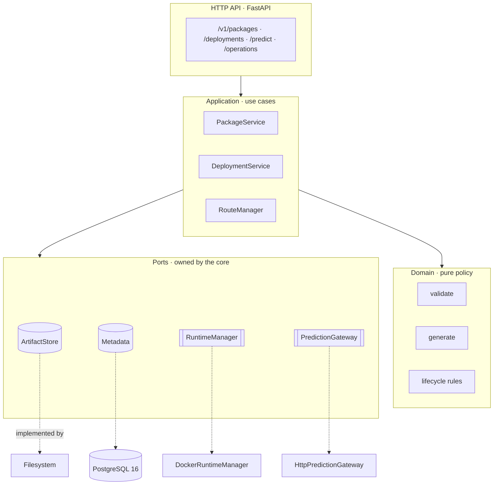
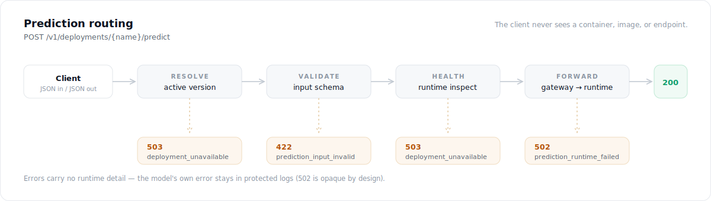
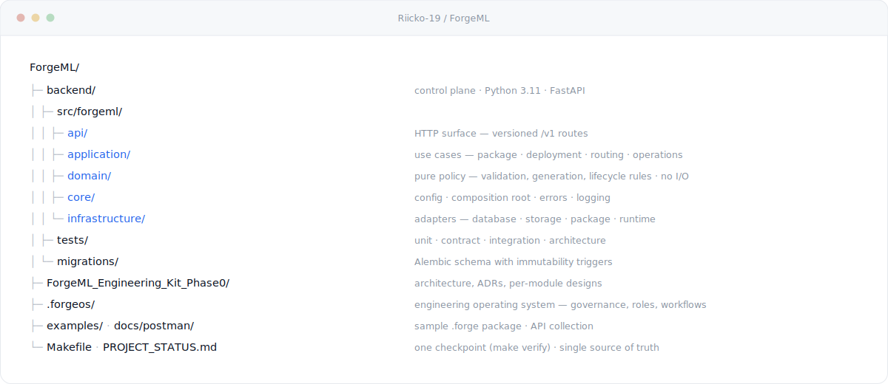
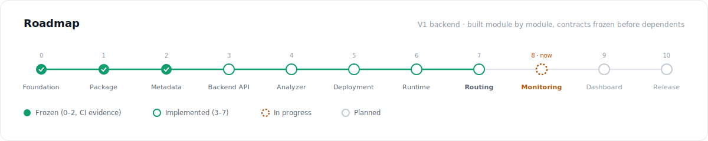

<div align="center">



<br>

**Point ForgeML at a packaged model. It validates it, builds an immutable image, runs it in a locked-down container, and gives you one stable URL with atomic version switching and instant rollback.**
<br>You write `predict()`. ForgeML does the plumbing.

[](https://github.com/Riicko-19/ForgeML/actions/workflows/backend-quality.yml)


</div>

---

<div align="center">

| **594** | **97%** | **21** | **8 / 11** |
|:--:|:--:|:--:|:--:|
| automated tests | branch coverage | decision records | modules built |

**Hexagonal architecture** · **Contract-first development** · **Deterministic builds** · **Repository-first engineering**

<sub>[Vision](#vision) · [Why ForgeML](#why-forgeml) · [Quick start](#quick-start) · [Architecture](#architecture) · [Security](#security-model) · [Roadmap](#roadmap) · [Why not Kubernetes](#why-not-kubernetes) · [FAQ](#faq) · [Contributing](CONTRIBUTING.md)</sub>

</div>

---

## Vision

ForgeML explores what a model-deployment platform looks like when it is built from first principles — Clean/Hexagonal architecture, immutable and content-addressed artifacts, explicit contracts, deterministic builds, and repository-driven engineering — rather than assembled from convenience.

The goal is not to compete with Kubernetes. The goal is a production-quality deployment path for **trusted inference models on a single server**, engineered with uncompromising discipline: every boundary is a port, every long action is a durable operation, every decision is written down, and every module is frozen behind passing CI before the next one depends on it.

> **What ForgeML is** — a clean, self-hosted path from a packaged model to a versioned, observable prediction API.
> **What it is not** — a training platform, an experiment tracker, or a multi-tenant orchestrator. It does one thing and refuses to sprawl.

---

## Why ForgeML

Serving a model behind a reliable endpoint is the same work every time, and it is rarely done well:

| The manual path, per model | With ForgeML |
| --- | --- |
| Write and maintain a Dockerfile | Generated deterministically from the package |
| Stand up a web server and request handling | A platform-managed route per deployment |
| Hand-roll input validation | Enforced against the model's declared JSON Schema |
| Wire health checks and resource limits | Built into every runtime, verified on start |
| Invent a versioning and rollback scheme | One active version; activate or roll back atomically |
| Hope the build is reproducible | Content-addressed identity; identical inputs, identical image |
| Bolt on an audit trail later | Append-only audit and durable operations from day one |

ForgeML turns that repeated, under-hardened plumbing into a **contract**. A model becomes a `.forge` package; a package becomes an immutable image; an image becomes an isolated runtime; a runtime becomes one stable route with a documented lifecycle. Deterministic, auditable, reversible — at every step.

---

## Quick start

**In one glance:**

```
install ──▶ run ──▶ upload ──▶ deploy ──▶ activate ──▶ predict
```

<div align="center"></div>

**Requirements** — Python **3.11** (ADR-013), **Docker**, and **PostgreSQL 16** (ADR-009; SQLite is not supported — durable operation claims need row-locking semantics it cannot express).

```bash
make setup      # venv + hash-locked dependencies
make db         # PostgreSQL 16 in Docker
make migrate    # apply the schema
make run        # control plane on http://127.0.0.1:8000
```

In another terminal — build the sample model and drive the pipeline:

```bash
make example    # builds examples/hello-model.forge

# 1) Upload — returns 202 and a durable operation you can poll
curl -X POST http://127.0.0.1:8000/v1/packages \
  -H "Idempotency-Key: $(uuidgen)" \
  -F "file=@examples/hello-model.forge"

# 2) Create a deployment — a stable name for a succession of versions
curl -X POST http://127.0.0.1:8000/v1/deployments \
  -H "Content-Type: application/json" -d '{"name":"scorer"}'

# 3) Build + run a version, then 4) activate it as the route target
curl -X POST http://127.0.0.1:8000/v1/deployments/<id>/versions \
  -H "Idempotency-Key: $(uuidgen)" -d '{"package_id":"<package_id>"}'
curl -X POST http://127.0.0.1:8000/v1/deployments/<id>/versions/<version_id>/activate \
  -H "Idempotency-Key: $(uuidgen)"
```

The endpoint your clients then call:

```http
POST /v1/deployments/scorer/predict
{ "value": 21 }              →  200  { "score": 21.0 }
```

> Prediction forwarding reaches the model on ForgeML's internal Docker network, so in production the control plane shares that network with the runtimes (ADR-010). Upload, build, deploy, and activation run directly on the host. `make help` lists every task; the [Postman collection](docs/postman/) has the full API wired up with assertions.

---

## Architecture

A **modular monolith**: one deployable, hexagonal internals. Domain logic is pure and deterministic; every I/O boundary is a **port** with a real adapter *and* an in-memory fake, both held to a single conformance suite so the fakes cannot drift from the contract.

<div align="center"></div>

The call flows downward; **source dependencies point inward**. The application depends on ports it owns (`RuntimeManager`, `PredictionGateway`, `ArtifactStore`, the metadata repositories); the adapters implement them. Nothing in the core imports a provider — enforced, not aspirational:

- **The domain cannot reach a provider.** `RouteManager` cannot import Docker; `sqlalchemy` cannot escape the database adapter — both are checked by AST tests in CI.
- **The runtime speaks the Docker CLI, not an SDK** — zero pinned runtime dependencies added by the platform. The one seam that touches `subprocess` is injectable, so lifecycle logic is unit-tested without Docker and proven end-to-end by disposable-Docker integration tests.
- **Adapters are swappable.** Filesystem and PostgreSQL today; the ports do not care.

<details>
<summary><b>Ports &amp; adapters, in detail</b></summary>

<br>



</details>

### Prediction routing

Clients speak only to ForgeML. A request is resolved to the deployment's one active version, validated, health-gated, and forwarded — and every failure maps to a platform error that leaks no runtime detail.

<div align="center"></div>

---

## Guarantees

Each row is a property the codebase enforces, with the decision record that governs it.

| Guarantee | How it holds |
| --- | --- |
| **Validation never runs your code** | The validator parses and schema-checks the archive; an architecture test fails the build if any validation path so much as imports `pickle`. |
| **Immutable, content-addressed artifacts** | A package is identified by the SHA-256 of its bytes; a build's identity folds in its inputs. Duplicate uploads are idempotent; identical inputs produce an identical image. *(ADR-003)* |
| **Crash-safe by construction** | Every long action — validate, build, start, activate, reconcile — is a durable, idempotent operation with a terminal state and startup recovery. No double-execution window. *(ADR-006 / ADR-016)* |
| **One active version, atomic switch** | Activation health-checks the candidate, then swaps the route under a row lock: the previous version steps down and the new one takes over, or neither does. Rollback is activating a prior version. *(ADR-005)* |
| **Hardened runtimes** | Non-root, read-only root filesystem, all Linux capabilities dropped, `no-new-privileges`, CPU/memory/PID limits, an egress-free internal network, and no Docker socket — asserted against a live `docker inspect`. *(ADR-001)* |
| **Desired vs. observed state** | Metadata is intent; Docker is observation. Reconciliation records and heals drift through documented actions — Docker is never treated as a database. *(ADR-004)* |
| **Nothing hidden** | Append-only audit log, server-owned request IDs, a single error envelope, and errors that never leak host paths, traces, or raw provider output. |

---

## Security model

ForgeML runs code that packages supply, so its trust boundary is explicit and narrow.

> **There is no authentication yet.** V1 assumes a **single trusted operator on a protected administrative network**. A package is a trusted administrative artifact — **not** a file accepted from anonymous users. **Do not expose the control plane to a network you do not control.** Public exposure requires an authorization decision (an ADR) that does not yet exist.

Within that boundary, isolation is defense-in-depth — not a safe sandbox for hostile code. Runtimes are unprivileged, read-only, capability-stripped, resource-limited, and network-isolated (ADR-001). The limits are documented, tested, and enforced rather than assumed; that is the point.

---

## Repository structure

<div align="center"></div>

| Path | What lives here |
| --- | --- |
| [`backend/src/forgeml/`](backend/src/forgeml/) | The control plane — `api` · `application` · `domain` · `core` · `infrastructure` |
| [`backend/tests/`](backend/tests/) | Unit · contract · integration · architecture tests |
| [`ForgeML_Engineering_Kit_Phase0/docs/`](ForgeML_Engineering_Kit_Phase0/docs/) | Architecture, ADRs, and per-module design documents |
| [`.forgeos/`](.forgeos/) | The engineering operating system — governance, roles, workflows, templates |
| [`examples/`](examples/) · [`docs/postman/`](docs/postman/) | A sample `.forge` package · the API collection |
| [`Makefile`](Makefile) · [`PROJECT_STATUS.md`](PROJECT_STATUS.md) | One checkpoint (`make verify`) · the single source of truth for progress |

---

## Roadmap

The V1 backend is built module by module. A contract freezes before anything depends on it, and a module is *frozen* only with passing CI evidence on its exact commit (ADR-014). Live truth is always [PROJECT_STATUS.md](PROJECT_STATUS.md).

<div align="center"></div>

| Phase | Module | State |
| --- | --- | --- |
| 0–2 | Foundation · Forge Package · Metadata | **Frozen** — CI evidence on the frozen commit |
| 3–7 | Backend API · Analyzer/Generator · Deployment · Docker Runtime · Routing | **Implemented** — full checkpoint green, freeze pending CI |
| 8 | Monitoring — logs, observations, retention | Planned — next |
| 9 | Dashboard | Planned |
| 10 | Hardening & release — backups, SBOM/scan, performance | Planned |

---

## Engineering standards

This repository treats its own process as a product.

- **One checkpoint, everywhere.** `make verify` runs the exact gates CI runs — format (`black`), lint (`ruff`), types (`mypy --strict`), the full test suite, contract tests, a locked build, and an installed-wheel smoke test — on Python 3.11 against a real PostgreSQL 16. Green locally means green in CI.
- **594 tests, 97% branch coverage**, spanning unit, contract (run against real adapters *and* their fakes), integration (real PostgreSQL, disposable Docker), end-to-end, and architecture (dependency-direction) tests.
- **Decisions are written down.** 17 Architecture Decision Records capture the *why*, with rejected alternatives, so they are not re-litigated.
- **[`.forgeos/`](.forgeos/)** — a repository-first engineering operating system: governance, roles, workflows, and templates, so any contributor can clone the repo and contribute correctly without prior context.

```bash
make test    # full suite (needs `make db`)
make lint    # black + ruff + mypy --strict (rewrites); `make verify` only checks
```

---

## Why not Kubernetes

ForgeML is not an alternative to these projects — it targets a different point in the design space. Each of the tools below is excellent at what it does; ForgeML deliberately trades their scale for determinism, explicit contracts, and a codebase small enough to reason about end to end.

| You may prefer | When your need is |
| --- | --- |
| **Kubernetes / KServe** | Multi-node scheduling, autoscaling, and cluster operations across a fleet |
| **BentoML** | A batteries-included packaging-and-serving framework with a managed cloud path |
| **TorchServe** | Framework-specific, high-throughput serving tuned for PyTorch |
| **ForgeML** | One trusted server, deterministic builds, explicit lifecycle contracts, and an architecture engineered to be understood and audited |

ForgeML's philosophy is narrow on purpose: **single server, deterministic, explicit contracts, architecture-first.** It is a production-quality control plane *and* a study in disciplined engineering — valuable to run, and valuable to read.

---


---

## FAQ

**What problem does ForgeML solve?** It removes the repeated, under-hardened plumbing between "I have a `predict()` function" and "there is a versioned, isolated, observable prediction endpoint," and replaces it with an explicit, reversible contract.

**Can it run on Kubernetes?** No. ForgeML is single-host by design (ADR-002); it manages local Docker rather than a cluster. Multi-node orchestration is an explicit non-goal.

**Does it train models?** No. ForgeML is inference-only. It does not own the model-development lifecycle.

**Can I deploy a PyTorch or scikit-learn model?** Yes — as a *python-callable* (ADR-008). Wrap the model behind a `predict(document)` entrypoint and declare `torch` or `scikit-learn` as exact pinned dependencies. ForgeML supports the callable interface; framework-specific serving adapters are a future, additive capability.

**Why the Docker CLI instead of the SDK?** It adds no pinned runtime dependency, and the daemon is reached the same way either approach would reach it. The one seam that shells out is injectable, so all lifecycle logic is unit-tested without Docker.

**Why PostgreSQL and not SQLite?** Durable operation claims depend on row-locking semantics SQLite cannot express (ADR-009). Correctness of the crash-recovery model requires it.

---

## Documentation

| Where | What |
| --- | --- |
| [PROJECT_STATUS.md](PROJECT_STATUS.md) | **Source of truth** — what is frozen, what is next, and the evidence |
| [CHANGELOG.md](CHANGELOG.md) | What changed in each release |
| [CONTRIBUTING.md](CONTRIBUTING.md) | Setup, the checkpoint, architectural rules, how to open a PR |
| [GOVERNANCE.md](GOVERNANCE.md) | Which documentation root owns what, and the authority order |
| [SECURITY.md](SECURITY.md) | Security model, current posture, how to report a vulnerability |
| [docs/DEVELOPMENT.md](docs/DEVELOPMENT.md) | How work moves from idea to frozen module |
| [docs/RELEASE.md](docs/RELEASE.md) | Versioning, compatibility promise, release steps |
| [docs/DEPENDENCY_REPORT.md](docs/DEPENDENCY_REPORT.md) | Advisories, licenses, pinning, and how to reproduce the audit |
| [backend/README.md](backend/README.md) | Configuration reference, API, quality gates |
| [`ForgeML_Engineering_Kit_Phase0/docs/`](ForgeML_Engineering_Kit_Phase0/docs/) | Architecture, ADRs, per-module designs |
| [docs/postman/](docs/postman/) | The API, hands-on, with assertions |
| [.forgeos/](.forgeos/) | Engineering process and governance |

---

## Non-goals

Kept out **on purpose**, so the core stays sharp. Each would require an ADR to enter scope — none is a "small addition":

`Kubernetes` · `multi-host scheduling` · `autoscaling` · `multi-tenancy` · `GPU scheduling` · `traffic splitting / canary / blue-green` · `a marketplace` · `training & experiments` · `arbitrary public package execution`

---

## License

[Apache License 2.0](LICENSE). Contributions are accepted under the same license.

ForgeML is **pre-1.0** and carries no compatibility guarantee until 1.0 ships — see [ADR-021](ForgeML_Engineering_Kit_Phase0/docs/10_ARCHITECTURE_DECISIONS.md) and [docs/RELEASE.md](docs/RELEASE.md) for the versioning and compatibility policy.

---

<div align="center">

**ForgeML**

Build. Deploy. Activate. Route. Serve.
<br>One frozen contract at a time.

<sub>Single-server model deployment control plane · built in the open.</sub>

</div>
