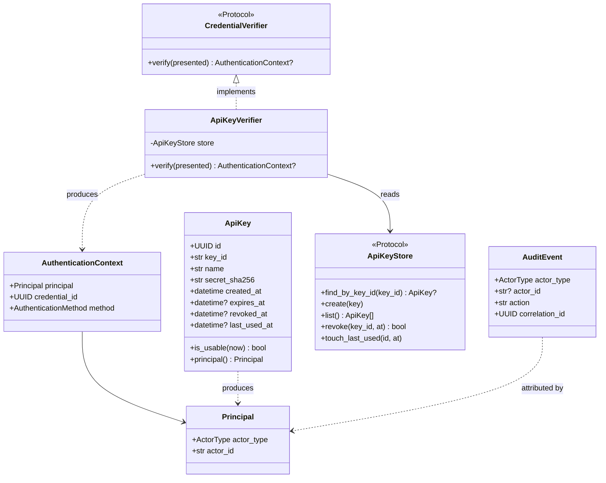
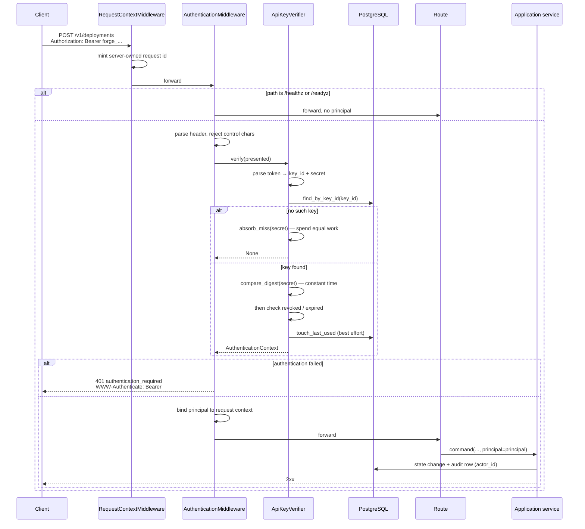
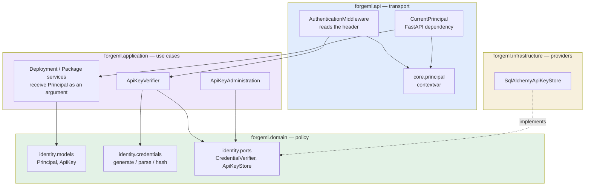
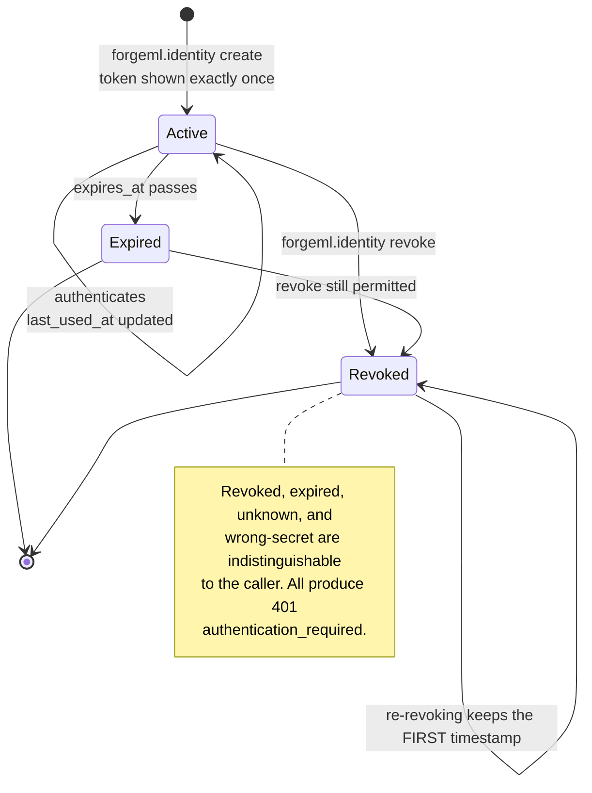
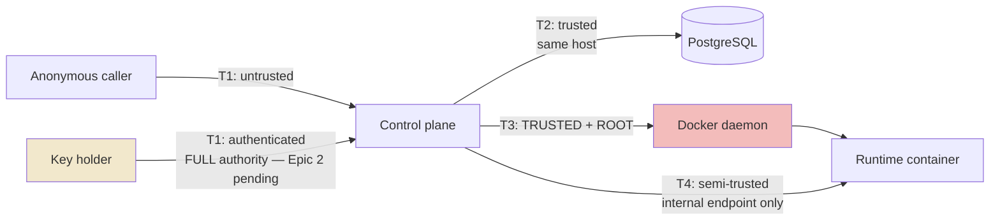

# Identity & Authentication Architecture

**Epic 1** · Decisions: [ADR-022 … ADR-026](../ForgeML_Engineering_Kit_Phase0/docs/10_ARCHITECTURE_DECISIONS.md)
Security analysis: [`SECURITY_REVIEW_EPIC_1.md`](SECURITY_REVIEW_EPIC_1.md) · Operator guide:
[`AUTHENTICATION_GUIDE.md`](AUTHENTICATION_GUIDE.md)

This document is the design. The ADRs hold the decisions and the reasoning; this shows how the
pieces fit and why the seams are where they are.

---

## The one-sentence version

A credential arrives as a header, is turned into a `Principal` by a verifier at the API boundary,
and travels no further as anything else — the application layer receives an identity value,
exactly as it already receives a correlation id.

---

## What exists, and what deliberately does not

ForgeML V1 has **one kind of principal**. That is a decision (ADR-023), not a gap.

| Concept | State | Where it would attach |
| --- | --- | --- |
| `Principal` | **Implemented** — `actor_type` + `actor_id` | — |
| `Credential` | **Implemented** — API key | — |
| `AuthenticationContext` | **Implemented** — principal + credential id + method | — |
| Anonymous principal | **Deliberately absent** | Nowhere. Absence is `None` — see below |
| Subject / user | Not implemented | A `users` table; `ActorType` gains `USER` |
| Service account | Merged into `OPERATOR` | A new `ActorType` member |
| Session | Not implemented | The Dashboard phase, not here |
| Role / group | Not implemented | Epic 2 — a role is an authorization input, not an identity |
| Tenant | Not implemented | V2 — a scope on `Principal`, not a new type |
| Delegation | Not implemented | `on_behalf_of` on `AuthenticationContext`, never on `Principal` |
| OIDC / JWT | Not implemented | A new `CredentialVerifier`; identity model unchanged |

**Every row attaches to an existing seam without changing `Principal`.** That is the test the
design sets for itself, and it is how the promise "no future authentication mechanism requires
redesigning the identity model" is kept: `Principal` carries only what is true of every principal
that will ever exist — a kind, and a stable identifier.

### Why there is no anonymous principal

An `ANONYMOUS` singleton would type-check everywhere an authenticated principal is expected. A
route that forgot its check would receive a valid-looking object with weak privileges and proceed.
`None` cannot do that — the type system rejects it at the call site.

**The absence of identity must be a compile-time error, not a runtime value.**

---

## Class model



`ApiKey` never carries the secret. Only `secret_sha256` is stored, so the record cannot be turned
back into a working credential — which is the property that matters when the *database* is what
leaks.

---

## Request flow



Two orderings in that diagram are load-bearing:

**Request context wraps authentication.** A 401 still carries a server-owned request id and is
logged like any other response. An untraceable rejection is one nobody can debug during an
incident.

**The secret is verified before the key's state.** Checking `revoked`/`expired` first would let an
attacker detect revocation by timing, which confirms a `key_id` is real.

---

## Layering



**No arrow points upward.** Three architecture tests hold this mechanically rather than by review:

- No `forgeml.application` or `forgeml.domain` module may import `starlette`, `fastapi`,
  `forgeml.api`, or `forgeml.core.principal`.
- `forgeml.domain.identity.credentials` is importable only from within the identity domain — a
  service that can hash a secret is one refactor from verifying one.
- `core.principal` has exactly one reader: `api/authentication.py`.

That last rule is the subtle one. Services take a `Principal` **as an argument**. If a service
read the contextvar instead, it would look pure while behaving differently depending on an ambient
value — the dependency would become invisible, and so would the bug.

---

## Credential lifecycle



Re-revoking preserves the original timestamp: the first revocation is the one the incident
timeline needs, and overwriting it would corrupt the record it exists to provide.

---

## Trust boundaries



**T3 is why this epic matters.** The control plane can drive the Docker daemon, and the daemon is
root. The authentication boundary is not protecting model metadata — it is protecting host root.

Epic 1 hardens **T1 only**. T2, T3, and T4 are unchanged.

---

## Attribution: what the audit trail records, and what it refuses to

`AuditEvent.actor_id` is nullable, and the nulls are meaningful.

| Event | Attribution | Why |
| --- | --- | --- |
| `package.uploaded` | The operator | They asked for it, in this request |
| `deployment.created` | The operator | Same |
| `deployment_version.building` / `ready` | The operator | Their command, executed synchronously |
| The same events after crash recovery | **`SYSTEM`, no actor** | The request that asked is gone; naming them would be a guess |
| `deployment.reconcile.*` | **`SYSTEM`, no actor** | The container drifted on its own — not an act by whoever triggered the sweep |
| Anything before Epic 1 | **`NULL`** | Those actions genuinely had no recorded principal |

The rule underneath all six rows: **the audit trail says "unknown" rather than guessing.** It is
append-only, so a synthetic actor would be a false claim that can never be corrected. That is
worth more than uniform-looking data.

The trigger of a reconciliation is still traceable — through the operation's `correlation_id` and
the request log — it simply is not recorded as the *cause* of the drift, because it was not.

---

## The extension seam

```python
class CredentialVerifier(Protocol):
    def verify(self, presented: str) -> AuthenticationContext | None: ...
```

One Protocol, one method. That is the entire extension mechanism.

Adding JWT means writing a class that implements it and composing it in the composition root. The
API layer, the application layer, the identity model, the audit trail, and every route are
unchanged. A plugin framework here would be the speculative generality the FEK forbids — **the
seam is the deliverable.**

`create_application(settings, verifier=...)` exposes that seam as a constructor parameter. It is
not a switch: there is no setting, environment variable, or header that reaches it, and
`bootstrap` always passes nothing.

---

## Why SHA-256 and not a password KDF

The decision most likely to be challenged in review, so the reasoning is recorded rather than
assumed (ADR-024).

A password KDF exists to impose cost on **guessing**, and guessing is only feasible against a
small search space — which is what human-chosen passwords are. ForgeML's secret is **256 bits from
the OS CSPRNG**. There is no guess space to protect: brute-forcing it is not made infeasible by a
work factor, it is already infeasible by counting.

Meanwhile a KDF's work factor is paid **on every authenticated request**, turning a sub-millisecond
lookup into a ~100 ms one — a denial-of-service amplifier any anonymous caller can trigger by
presenting garbage.

The property a stored-credential decision must actually deliver is *a database dump yields no
working credentials*, and SHA-256 over 256 random bits delivers it. This is the same construction
Stripe and GitHub use for machine tokens.

**This reasoning is load-bearing on the entropy.** `test_the_secret_carries_the_entropy_the_hashing_decision_rests_on`
asserts the 32-byte width, so a silent narrowing fails the build rather than quietly invalidating
the argument.

---

## Known limitation

**Until Epic 2, every API key is a root credential for the host.** There are no scopes, no
read-only keys, and no separation between a CI pipeline's key and an administrator's. ForgeML now
knows *who* is asking; it does not yet limit *what* they may ask for.

See [`SECURITY_REVIEW_EPIC_1.md`](SECURITY_REVIEW_EPIC_1.md) finding 5 for the required interim
mitigations.
